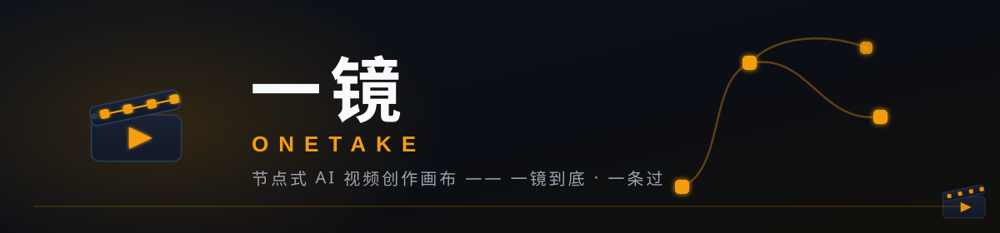
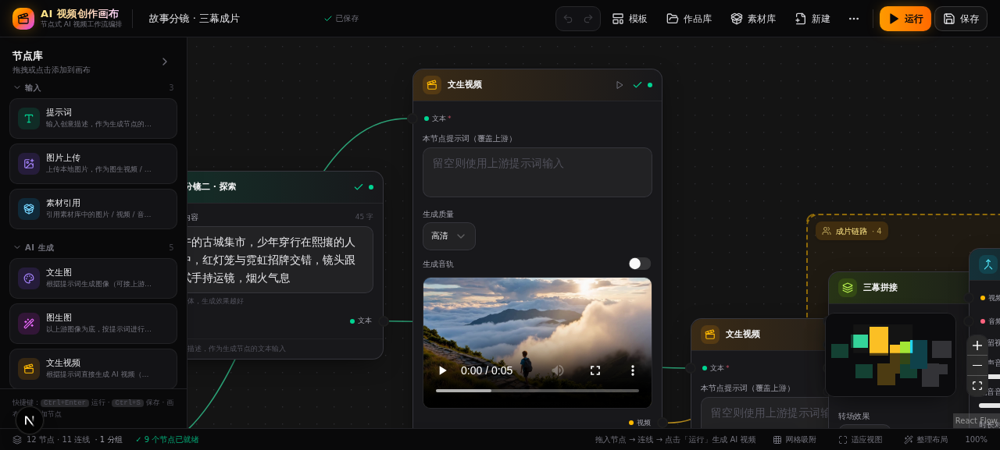
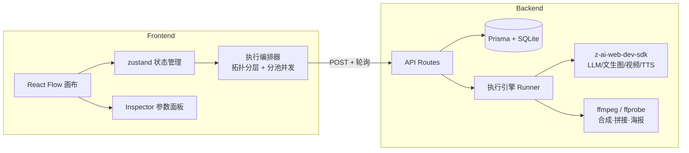

# 🎬 一镜 OneTake

<div align="center">
  
  <p><sub><b>一镜到底 · 一条过</b> —— 文案、画面、配音、剪辑，一张画布一条流，一镜到底出成片。</sub></p>
</div>

> 节点式 AI 视频创作画布平台 — 参考 RunningHub / ComfyUI / 商汤 SEKO 的交互范式，从「提示词」到「成片」的全链路可视化创作。

**Node-based AI video creation canvas** — drag nodes, wire pipelines, and produce real AI-generated videos: prompt engineering → image/video generation → TTS voiceover → ffmpeg editing → final cut, all on one canvas.

<p align="center">
  
</p>

<p align="center">
  <em>「故事分镜 · 三幕成片」模板：三路文生视频并行生成 → 三幕拼接 → AI 配音 → 成片合成</em>
</p>

---

## 🌐 在线体验

**一镜 OneTake** 支持一分钟本地起跑（见下方[快速开始](#-快速开始)），云托管版地址将在部署后更新于此。

- 📦 **开箱即用**：`bun install && bun run db:push && bun run dev` → http://localhost:3000
- 🧩 内置 12 个场景模板，打开即可一键载入完整创作链路
- ⚙️ 支持接入自有模型服务（OpenAI 兼容），数据与密钥全部留在本机

---

## ✨ 核心特性

- **🔗 节点式编排**：14 种节点覆盖 输入 → AI 生成 → 编辑处理 → 输出 四大类，类型化端口 + 连线实时校验（文本/图像/视频/音频四色数据流）
- **🤖 真实 AI 执行管线**（非模拟）：
  - LLM 提示词智能扩写（7 种风格 × 视频/图像目标）
  - CogView 文生图 / 图生图
  - 文生视频 / 图生视频（云端异步任务 + 轮询 + 断线恢复）
  - TTS 智能配音（4 种音色 + 语速调节，PCM → WAV 服务端封装）
- **🧩 多供应商模型配置**：按能力维度（LLM / 图像 / 语音 / 视频）接入自定义模型服务（OpenAI 兼容协议），Base URL + API Key + 模型名自由组合，连通性测试、密钥脱敏存储、未配置自动回落内置智谱
- **✂️ 内置媒体引擎**：服务端 ffmpeg 驱动的「成片合成」（配音混流/时长对齐/音量控制）与「视频拼接」（5 种转场 + 画幅统一 + 快速预览档），自动抽帧生成首帧海报
- **⚡ 并行执行引擎**：拓扑分层 + 按节点类型分池限流（视频串行池 / 图像池 / LLM 池 / ffmpeg 池），429 限流指数退避重试，失败仅阻断传递下游
- **🎨 专业画布体验**：智能对齐参考线吸附、节点编组（框体/折叠/整体运行/成员拖拽增减）、框选多选与批量对齐分布、撤销/重做、复制/粘贴、minimap 运行状态高亮
- **💾 全链路持久化**：工作流 CRUD + 防抖自动保存（含竞态防护）+ 画布缩略图 + 刷新后输出恢复 + 远程任务找回（reclaim）
- **🗂️ 素材库**：全部生成产物自动归类，搜索/排序/上传/重命名（级联更新画布引用）/删除（引用计数检查）/一键插入画布/导出归档
- **📊 运行历史**：执行记录 + 耗时 + 错误 + 产物缩略图 + 画布快照迷你图（悬停联动高亮、点击定位节点）+ 一键重跑失败节点

## 🐱 品牌与 IP：导演阿镜

<div align="center">
  
</div>

**阿镜**（A-Jing），一镜 OneTake 的橘猫导演：

- 🎩 **黑色贝雷帽 + 场记板**：场记板上写着「一镜 ONE TAKE」，片场最高指令——一条过
- 🔌 **尾巴即连线**：尾巴末端是一根视频线缆插头——节点与节点之间的连接，就是阿镜的身体语言
- 👁️ **光圈瞳孔**：眼睛里有相机光圈般的高光，随时在取景
- 🟠 **琥珀同源**：橘猫毛色 = 画布运行态主色（amber），IP 与产品天然一体
- 💬 **口头禅**：“一镜，一条过！” / “收工，That's a wrap~”

> 品牌资产（SVG 矢量，可自由缩放）：`docs/brand/` — logo.svg / mascot-ajing.svg / banner.svg

## 🎛️ 节点体系（14 种）

| 分类 | 节点 | 说明 |
|---|---|---|
| **输入** | 📝 提示词 | 文案输入，作为生成节点的文本源 |
| | 🖼️ 图片上传 | 本地图片上传（落盘 `/public/uploads`） |
| | 🗃️ 素材引用 | 引用素材库已有图片/视频/音频，即插即用 |
| **AI 生成** | ✨ 提示词优化 | LLM 按目标风格智能扩写提示词 |
| | 🎨 文生图 | CogView 文本生成图像（多尺寸可选） |
| | 🖌️ 图生图 | 以上游图像为底按提示词重绘 |
| | 🎥 文生视频 | 文本直接生成 AI 视频（高清/极速档） |
| | 📹 图生视频 | 让静态图片动起来（可选生成音轨） |
| | 🎙️ AI 配音 | TTS 文本转语音，4 音色 + 0.6x-1.5x 语速 |
| **编辑处理** | 🎚️ 成片合成 | 视频 + 配音混流输出成品（混音/时长对齐/音量） |
| | 🧩 视频拼接 | 最多 4 段顺序拼接（硬切/叠化/擦除/上滑/圆形展开转场） |
| **输出** | 🖼️ 图像预览 | 展示上游图像结果 |
| | ▶️ 视频预览 | 展示上游视频结果（含首帧海报） |
| | 🔊 音频预览 | 播放上游音频结果（波形 UI） |

数据类型端口：**文本** <span style="color:#34d399">emerald</span> / **图像** violet / **视频** amber / **音频** rose — 连线时自动校验类型匹配。

## 🧩 模型服务配置（多供应商）

顶栏 ⚙️「模型服务配置」按能力维度路由模型服务，未配置/关闭时自动使用内置智谱：

| 能力 | 影响节点 | 自定义协议 | 说明 |
|---|---|---|---|
| 文本生成 LLM | 提示词优化 | `POST /chat/completions` | 任意 OpenAI 兼容服务 |
| 图像生成 | 文生图 | `POST /images/generations` | 兼容 b64_json / url 响应 |
| 语音合成 TTS | AI 配音 | `POST /audio/speech` | 二进制音频响应，自动落盘 |
| 视频生成 | 文/图生视频 | —（内置） | 供应商扩展点已预留 |

- 密钥仅存本机数据库，接口永远脱敏回显（`sk-***abcd`），留空不覆盖
- 一键「测试连接」验证连通性与鉴权（含延迟显示）
- 执行时节点阶段实时显示「使用自定义模型 xxx…」

## 📚 内置模板（12 个 × 6 大创作场景）

| 分类 | 模板 | 链路 |
|---|---|---|
| 基础入门 | 提示词工坊 · 一键扩写 | 提示词 → LLM 优化 |
| 基础入门 | 文生视频 · 极速出片 | 提示词 → 文生视频 → 预览 |
| 基础入门 | 图生视频 · 让照片动起来 | 图片上传 → 图生视频 → 预览 |
| 基础入门 | 产品展示 · 一图变大片 | 上传 → 图生图 → 图生视频 |
| 基础入门 | 全流程 · 提示词工程到成片 | 提示词 → 优化 → 文生图 → 图生视频 → 预览 |
| 短剧创作 | **故事分镜 · 三幕成片** | 三幕提示词 → 3×文生视频（并行）→ 三幕拼接 ∥ 旁白配音 → 成片合成 |
| 短剧创作 | **小说转剧本 · 短剧成片** | 小说原文 → AI 剧本改编 → 三幕分镜 → 3×文生视频 → 拼接 ∥ 配音 → 成片合成 |
| 音乐 MV | **MV 音乐视频 · 画面成片** | 音频素材（任意上传音乐）→ 3×画面文生视频 → 转场拼接 → 以音频时长对齐合成 |
| 营销宣传 | **文旅宣传片 · 城市印象** | 城市亮点 → 解说文案 → 3×地标/人文/夜景视频 → 拼接 → 配音合成 |
| 知识创作 | **知识科普 · 图解动画** | 知识点文案 → 配音 ∥ 2×示意图生成 → 图动起来 → 拼接 → 合成 |
| 营销带货 | **好物开箱 · 口播带货** | 产品卖点 → 口播文案优化 → 配音 ∥ 产品图动态展示 → 合成 |
| 营销带货 | 口播视频 · 配音合成成片 | 文案 → AI 配音 ∥ 画面生成 → 成片合成 → 预览 |

## ⌨️ 快捷键

| 快捷键 | 功能 | 快捷键 | 功能 |
|---|---|---|---|
| `Ctrl + Enter` | 运行全图 | `Ctrl + S` | 保存工作流 |
| `Ctrl + Z` / `Ctrl + Shift + Z` | 撤销 / 重做 | `Ctrl + C` / `Ctrl + V` | 复制 / 粘贴节点 |
| `Ctrl + G` / `Ctrl + Shift + G` | 编组 / 解组 | `Delete` | 删除所选 |

## 🚀 快速开始

```bash
# 1. 安装依赖（需要 bun >= 1.0，同时需要系统安装 ffmpeg / ffprobe）
bun install

# 2. 初始化数据库（SQLite + Prisma）
bun run db:push

# 3. 启动开发服务器
bun run dev
# → http://localhost:3000

# 4. 代码检查
bun run lint
```

> **AI 能力说明**：执行引擎通过 `z-ai-web-dev-sdk` 调用 LLM / 文生图 / 图生视频 / TTS 等模型服务，视频任务为云端异步生成（单段约 1-5 分钟，视质量档位而定）。

## 🏗️ 技术架构



**技术栈**

| 层 | 选型 |
|---|---|
| 框架 | Next.js 16 (App Router) + TypeScript 5 + React 19 |
| 画布 | React Flow (@xyflow/react) |
| 状态 | zustand（快照式撤销/重做历史栈） |
| UI | Tailwind CSS 4 + shadcn/ui + Lucide 图标 |
| 数据 | Prisma ORM + SQLite（Workflow / Execution 两表） |
| 媒体 | 服务端 ffmpeg（合成/拼接/混流/抽帧）+ ffprobe 探测 |
| AI | z-ai-web-dev-sdk（LLM / CogView / 视频生成 / TTS） |

**目录结构**

```
src/
├── app/
│   ├── page.tsx                 # 画布主页面
│   └── api/
│       ├── workflows/           # 工作流 CRUD
│       ├── executions/          # 执行任务（创建/轮询/挂靠/找回/历史）
│       ├── assets/              # 素材库（列表/上传/重命名/删除/导出）
│       └── uploads/             # 图片/视频/音频上传
├── components/ai-canvas/
│   ├── editor.tsx               # 画布编辑器（交互中枢）
│   ├── nodes/graph-node.tsx     # 通用节点渲染（状态/进度/预览/工具栏）
│   ├── inspector.tsx            # 右侧属性面板
│   ├── palette.tsx              # 左侧节点库
│   ├── group-layer.tsx          # 分组 overlay 图层
│   ├── alignment-guides.tsx     # 智能对齐参考线
│   ├── assets-dialog.tsx        # 素材库对话框
│   ├── history-dialog.tsx       # 运行历史对话框
│   ├── templates-dialog.tsx     # 模板库
│   └── topbar.tsx               # 顶部工具栏
└── lib/ai-canvas/
    ├── types.ts                 # 节点注册表（14 种）+ 连线校验
    ├── executor.ts              # 执行编排（拓扑分层 + 分池并发 + 重试）
    ├── runner.ts                # 执行引擎（AI 调用 + ffmpeg）
    ├── templates.ts             # 内置模板
    ├── persistence.ts           # 保存/载入/自动保存
    └── store.ts                 # zustand store（含撤销栈）
```

## 🔌 API 一览

| 方法 | 路径 | 说明 |
|---|---|---|
| `GET/POST` | `/api/workflows` | 工作流列表 / 创建 |
| `GET/PUT/DELETE` | `/api/workflows/[id]` | 工作流详情 / 更新（含缩略图）/ 删除 |
| `POST` | `/api/executions` | 创建执行任务（后台异步运行） |
| `GET` | `/api/executions/[id]` | 任务状态 / 进度 / 结果轮询 |
| `POST` | `/api/executions/attach` | 保存时挂靠游离执行记录 |
| `POST` | `/api/executions/reclaim` | 找回云端超时视频任务成果 |
| `GET` | `/api/executions/history` | 运行历史（工作流维度） |
| `GET/PUT` | `/api/settings/providers` | 模型供应商配置（按能力维度，密钥脱敏） |
| `POST` | `/api/settings/providers/test` | 供应商连通性测试 |
| `GET/PATCH/DELETE` | `/api/assets` | 素材库管理（含引用计数 / 级联重命名） |
| `POST` | `/api/assets/export` | 导出素材到归档目录 |
| `POST` | `/api/uploads` | 图片 / 视频 / 音频上传（80MB 上限） |

## 🛡️ 工程健壮性设计

- **任务恢复**：刷新/断线后自动接管运行中任务、回填已完成输出（`resumeWorkflowTasks`）
- **僵尸任务治理**：视频任务 remoteTaskId 落库，超时后可「找回云端任务」恢复成果
- **限流防御**：429/5xx 指数退避重试 + 按接口类型分池限流（视频 API 单活跃任务约束）
- **数据竞态防护**：自动保存定时器绑定工作流 id，杜绝「打开即保存」与跨工作流覆盖
- **原子化撤销**：同一删除批次单快照，节点 + 连线完整恢复
- **安全校验**：素材路径穿越防御、上传类型白名单、删除前引用计数确认

## 🗺️ Roadmap

- [ ] 分组成员批量入组 / 分组模板片段化
- [ ] 视频任务配额预检（提交前探测性请求）
- [ ] 执行历史按节点分组折叠 + 快照 diff 对比
- [ ] 画布 PNG 快照分享
- [ ] 更多生成节点：视频配乐、字幕烧录、图像搜索素材
- [ ] 多人协作（WebSocket 实时同步画布）

## 致谢

交互设计参考 [RunningHub](https://www.runninghub.cn/)、[ComfyUI](https://github.com/comfyanonymous/ComfyUI)、商汤 SEKO 的节点式创作范式；画布能力基于 [React Flow](https://reactflow.dev/) 构建。

---

<div align="center">
  <sub>Built with ⚡ by Z.ai Code · Next.js 16 + React Flow + ffmpeg</sub>
</div>
